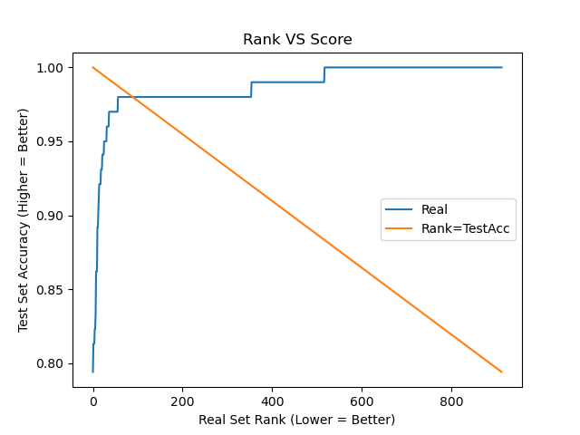

# ARC

This is a quick analysis of [François Chollet’s Abstraction and Reasoning Challenge](https://www.kaggle.com/c/abstraction-and-reasoning-challenge/overview).


#### Process

I wrote a quick JavaScript two-liner injection that would extract all the data in JSON form:

```javascript
document.getElementsByClassName("competition-leaderboard__benchmark-row")[0].remove(); //Remove the sample_submission
console.log(JSON.stringify(Array.from(document.getElementsByClassName("competition-leaderboard__td-score")).map((x)=>parseFloat(x.innerText)))); //Log the rank and test accuracy data
```

Then I wrote a quick Python script that uses Natplotlib to graph it.


#### Results



The results are unexpected. The orange line is if the testing accuracy was an 100% reliable indication of how well the models would perform (rank/real accuracy). The blue line is the testing accuracy vs real rank. This seems to imply that testing accuracy is not an accurate estimation of how well the models generalize.
